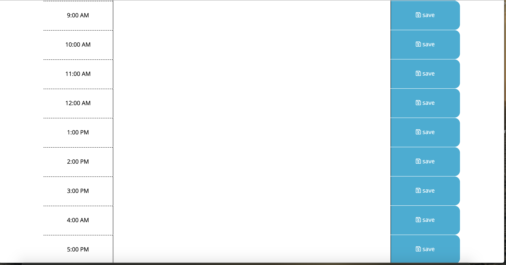

# The-Daley-Daily-Planner
Assignment 5, written by Danielle Daley.
## Description
This is a daily planner that works for people with all sorts of busness hours instead of the standard business hours. At the top of the screen you will see the correct date. It will tell you what time it is by highlighted blocks based on when in the day it is. You as the user can put in whatever you need to do in that hour and hit save. The planner will remember it by using local storage. This is written using HTML, CSS, JavaScript and uses Jquery and Moment.js, as well as some bootstrap.

## Links
[Git Repo](https://github.com/danielledaley2196/The-Daley-Daily-Planner)
 
[Live Application](https://danielledaley2196.github.io/The-Daley-Daily-Planner/)

## Screenshots

 
